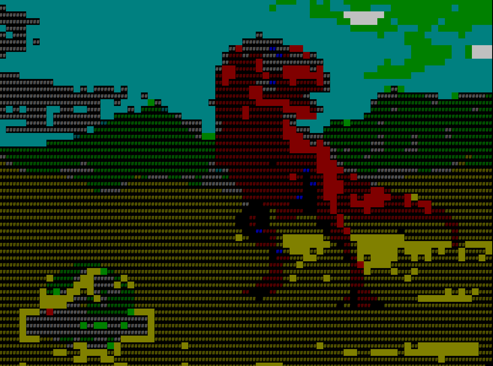
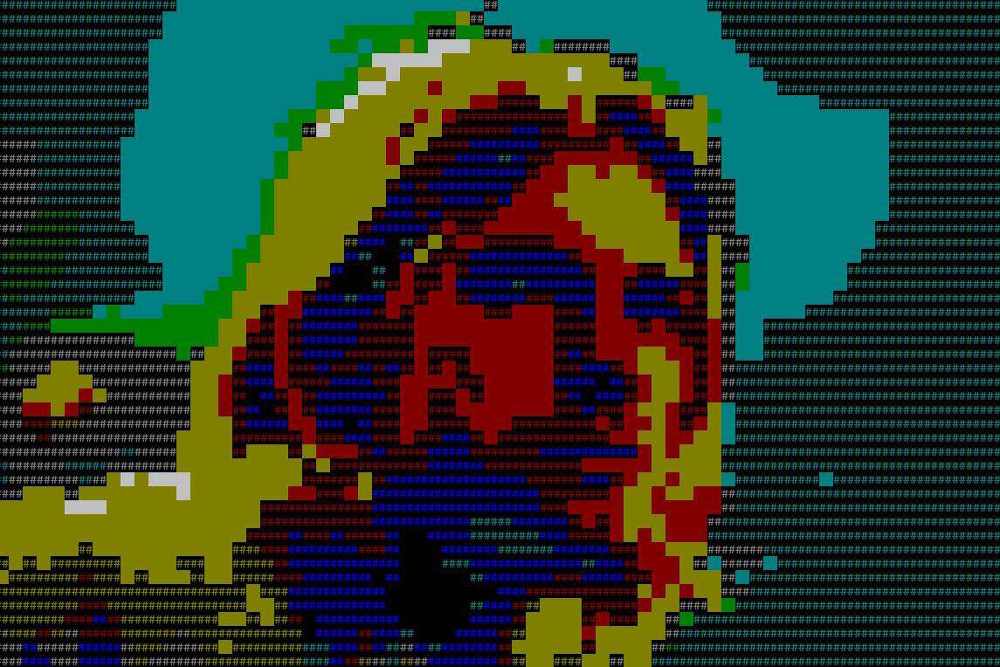

# Chalk Image Converter

##About:

Convert your images into console-code with Chalk!

#Examples:

----

----

##Instructions:

Just include your chalk-image: `var ci = require('chalk-image');`

Then draw!: `ci.drawImg('path/to/my/img.jpg')`

Works best with BMPs and JPEGs!

##Credits:
Written by me, [David Newman](https://github.com/Newms34).
